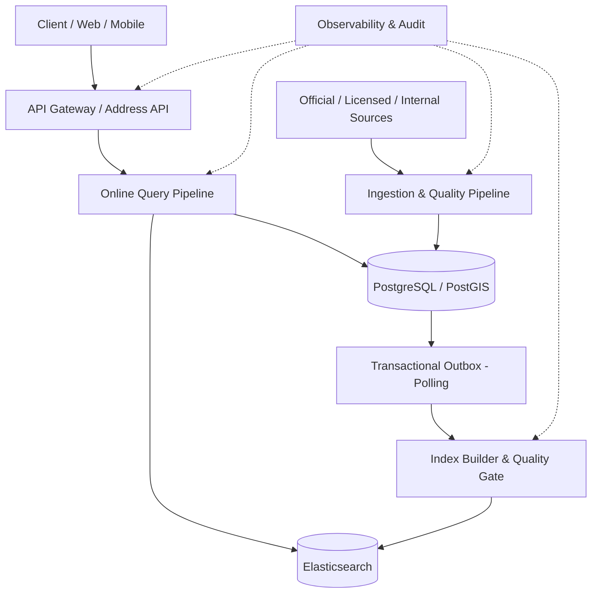
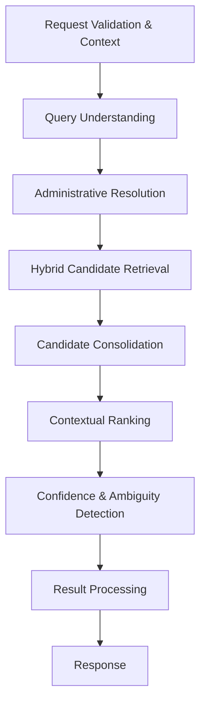
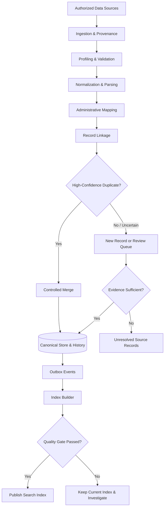
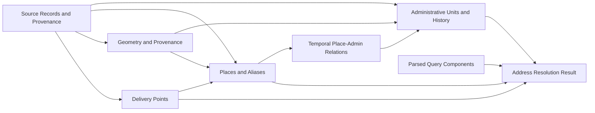

# ADDRESS INTELLIGENCE PLATFORM

# Kiến trúc xử lý địa chỉ Việt Nam: Nhiễu, trùng lặp và biến động hành chính

| Thông tin | Giá trị |
|---|---|
| Tên tài liệu | Kiến trúc xử lý địa chỉ Việt Nam |
| Dự án | Address Intelligence Platform |
| Tác giả | Lê Phước Thắng |
| Loại tài liệu | High-Level Design (HLD) / Domain Architecture |
| Phiên bản | 1.1 |
| Trạng thái | HLD đã đối chiếu baseline place-centric; chi tiết triển khai được đặc tả theo từng phase |
| Ngày cập nhật | 23/09/2026 |

> **Phạm vi:** Tài liệu mô tả kiến trúc logic phục vụ autocomplete, tìm kiếm, phân giải và chuẩn hóa địa chỉ Việt Nam; bao gồm luồng truy vấn trực tuyến, luồng dữ liệu nền, mô hình dữ liệu khái niệm và các nguyên tắc bảo đảm chất lượng. Đây không phải bản đặc tả API, DDL hay thiết kế triển khai chi tiết.

---

## 1. Mục tiêu và phạm vi

### 1.1. Mục tiêu

- Gợi ý và phân giải địa chỉ ngay cả khi đầu vào **không dấu, viết tắt, sai chính tả, thiếu cấp hành chính hoặc dùng tên cũ**.
- Phân biệt **trùng chuỗi** với **trùng thực thể**: hai địa chỉ có cùng tên đường/số nhà không nhất thiết là cùng một địa điểm.
- Xử lý **địa giới hành chính theo thời điểm**, giữ khả năng tìm kiếm bằng tên cũ mà không làm mất thông tin lịch sử.
- Trả về **nhiều ứng viên kèm ngữ cảnh** khi truy vấn không đủ căn cứ, thay vì tự động chọn một địa chỉ có nguy cơ sai.
- Duy trì nguồn dữ liệu chuẩn có thể truy vết; tách dữ liệu giao dịch, dữ liệu tìm kiếm và cache.
- Cho phép mở rộng từng runtime mà vẫn giữ định hướng **Modular Monolith, Service-ready**.

### 1.2. Những bài toán đặc thù

| Tình huống | Ví dụ đầu vào | Yêu cầu xử lý |
|---|---|---|
| Không dấu / viết tắt | `12 Nguyen Trai, Q1, HCM` | Nhận diện biến thể, tra cứu địa danh lịch sử khi cần |
| Lỗi gõ | `Nguyễn Trải` | Tìm kiếm chịu lỗi nhưng không bỏ qua ràng buộc địa giới |
| Thiếu thông tin | `Ấp 3, Bình Hòa` | Tìm các khả năng hợp lệ; yêu cầu thêm tỉnh/xã nếu cần |
| Trùng tên | `123 Nguyễn Trãi` | Phân biệt các địa phương và các thực thể khác nhau |
| Tên hành chính cũ | Tên phường/xã trước khi thay đổi địa giới | Đối chiếu phiên bản lịch sử và tên hiện hành |
| Địa chỉ phi cấu trúc | `Hẻm cạnh chợ, gần trường tiểu học` | Nhận diện địa danh, mô tả vị trí; không tự suy diễn số nhà |
| Một địa điểm, nhiều tên | Tên chính thức, tên dân gian, tên đơn vị trước đây | Quản lý alias có nguồn gốc và thời hạn hiệu lực |
| Một địa chỉ, nhiều điểm giao | Tòa nhà có nhiều cổng hoặc khu giao nhận | Phân biệt `Address` với `DeliveryPoint` |

### 1.3. Ngoài phạm vi

- Không cam kết suy ra số nhà, tọa độ hoặc điểm giao hàng khi nguồn không đủ bằng chứng.
- Không xem điểm tìm kiếm của search engine là xác suất địa chỉ chính xác.
- Không tự động hợp nhất dữ liệu chỉ dựa vào mức độ tương đồng chuỗi.
- Không định nghĩa lại response envelope, middleware và quy ước lỗi đã có trong tài liệu nền tảng của dự án.

---

## 2. Nguyên tắc kiến trúc

1. **Domain first, layer second:** Tổ chức code theo module nghiệp vụ; bên trong mỗi module mới tách `domain`, `application`, `infrastructure`, `transport`.
2. **Nguồn sự thật có kiểm soát:** PostgreSQL/PostGIS lưu dữ liệu chuẩn và lịch sử; Elasticsearch là read model có thể tái tạo. Redis không thuộc baseline MVP; chỉ xem xét sau benchmark.
3. **Phân biệt chuẩn hóa với phân giải:** Chuẩn hóa chỉ tạo dạng biểu diễn có thể so sánh; phân giải mới quyết định bản ghi có đại diện cho cùng một thực thể hay không.
4. **Giữ nguyên dữ liệu nguồn:** Lưu dữ liệu gốc, nguồn, thời điểm ghi nhận và quy tắc biến đổi để có thể kiểm tra lại.
5. **Địa giới có phiên bản:** Tên hành chính, quan hệ cấp trên và hình học ranh giới được xét theo thời gian; chuyển đổi cũ–mới có thể là một–nhiều hoặc nhiều–nhiều.
6. **Không đánh đổi an toàn dữ liệu để lấy độ phủ:** Trường hợp thiếu bằng chứng được trả về dưới dạng chưa phân giải hoặc cần người dùng xác nhận.
7. **Tách online và offline:** API ưu tiên latency thấp; nhập liệu, đối soát, hợp nhất, reindex và kiểm định chạy nền.
8. **Mọi quyết định quan trọng có thể giải thích:** Ghi nhận nguồn dữ liệu, tín hiệu khớp, phiên bản mô hình/quy tắc, index và nguyên nhân chưa phân giải.

---

## 3. Tổng quan kiến trúc hệ thống

Canonical data và outbox được ghi trong cùng transaction. Baseline không cần Redis, message broker hoặc API gateway riêng; các khối trên thể hiện trách nhiệm logic. Kiểm định index được phát triển theo từng phase, không yêu cầu toàn bộ quality platform ngay từ P0.

**Hai nhánh xử lý chính:**

- **Online Processing:** nhận và diễn giải truy vấn, tìm ứng viên, phân biệt thực thể, xếp hạng và phát hiện mơ hồ.
- **Background Processing:** tiếp nhận nguồn dữ liệu, kiểm tra, chuẩn hóa, đối soát trùng, quản lý địa giới, xuất bản index và kiểm định chất lượng.

> Các khối trong sơ đồ là **capability logic**, không đồng nghĩa mỗi khối là một microservice. Ở giai đoạn đầu có thể cùng một codebase, triển khai thành các runtime API, Worker và Indexer khi cần.

---

## 4. Online Processing — luồng xử lý truy vấn

### 4.1. Pipeline đề xuất

**Lưu ý:** API có thể phân nhánh theo use case. Autocomplete, resolve, validate và geocode không bắt buộc chạy đủ mọi bước hoặc gọi nhau tuần tự.

### 4.2. Trách nhiệm từng lớp

| Lớp | Input chính | Xử lý | Output |
|---|---|---|---|
| 1. Request & Context | Truy vấn, locale, geo hint, tenant, API version | Xác thực, giới hạn request, kiểm tra dữ liệu, ngữ cảnh sử dụng | Request hợp lệ |
| 2. Query Understanding | Văn bản gốc | Unicode normalization, không dấu có kiểm soát, viết tắt, tokenization, parse số nhà/đường/đơn vị hành chính | `ParsedQuery` và các biến thể |
| 3. Administrative Resolution | `ParsedQuery`, thời điểm tham chiếu | Nhận diện đơn vị hành chính, tên cũ/mới, kiểm tra quan hệ cấp trên và trường hợp split/merge | `AdminContext` cùng mức chắc chắn |
| 4. Hybrid Retrieval | Query và `AdminContext` | Exact, prefix, lexical, fuzzy, alias, địa danh và geo-filter khi có dữ liệu | Tập ứng viên có nguồn tín hiệu |
| 5. Candidate Consolidation | Ứng viên từ nhiều chiến lược | Gộp hit cùng loại thực thể và canonical ID; kết quả địa chỉ tổng hợp phải giữ khác biệt về thành phần và ngữ cảnh | Ứng viên duy nhất theo thực thể |
| 6. Contextual Ranking | Ứng viên, ngữ cảnh | Xếp hạng theo mức khớp, đầy đủ hành chính, chất lượng nguồn, vị trí, ngữ cảnh | Danh sách có thứ tự |
| 7. Confidence & Ambiguity | Điểm và các tín hiệu | Phát hiện thiếu bằng chứng, điểm sát nhau, mâu thuẫn hành chính, độ chính xác tọa độ | Trạng thái phân giải |
| 8. Result Processing | Danh sách đã đánh giá | Top-K, hiển thị tên hiện hành và alias khi thích hợp, lý do cần xác nhận | Response DTO |

### 4.3. Quy tắc Query Understanding

- Giữ `raw_query` cho mục đích truy vết có kiểm soát; đồng thời tạo `normalized_query` để tìm kiếm.
- Canonical text giữ dấu tiếng Việt theo Unicode NFC; dạng không dấu chỉ phục vụ tìm kiếm. Chuẩn hóa khoảng trắng và diễn giải dấu câu/viết tắt (`TP`, `Q`, `P`, `X`, `Đ`, v.v.) theo ngữ cảnh bằng bộ quy tắc có phiên bản; không làm mất cấu trúc có ý nghĩa như số nhà/hẻm.
- Hỗ trợ cả từ có dấu và không dấu, nhưng không coi mọi chuỗi không dấu là tương đương tuyệt đối.
- Phân tích từ cấp rộng đến cấp hẹp khi ngữ cảnh có đủ thông tin: tỉnh/thành → đơn vị hành chính → đường/hẻm → số nhà → địa danh/điểm giao.
- Chấp nhận các định dạng địa chỉ lịch sử; không bắt buộc một địa chỉ cũ phải chứa các trường hành chính của mô hình hiện hành.
- Giới hạn độ phức tạp và số biến thể truy vấn để tránh query explosion.
- Parse được số nhà không có nghĩa số nhà đã được xác minh tồn tại. Không tạo canonical record cho mọi tổ hợp số nhà + đường.

### 4.4. Administrative Resolution

Hệ thống phải nhận diện được một tên địa danh ở **thời điểm cụ thể**, không chỉ tra cứu bảng đơn vị hành chính hiện hành.

**Quy tắc bắt buộc:**

- Nếu một tên hành chính cũ chỉ ánh xạ duy nhất khi có đủ số nhà, đường, tọa độ hoặc vùng ranh giới, chỉ kết luận sau khi xác minh ngữ cảnh đó.
- Trường hợp sáp nhập, chia tách hoặc thay đổi ranh giới phải lưu quan hệ nguồn–đích và thời điểm hiệu lực; không ép thành một cột `new_unit_id` duy nhất.
- Nếu tên cũ dẫn tới nhiều đơn vị hiện tại và không có đủ thông tin, trả nhiều ứng viên hoặc `AMBIGUOUS`.
- Không mặc định loại bỏ cấp huyện trong địa chỉ lịch sử; vẫn hỗ trợ parse và tìm kiếm theo ngữ cảnh cũ.
- Mỗi quyết định chuyển đổi cần truy vết phiên bản và nguồn dữ liệu hành chính đã sử dụng; cách biểu diễn version thuộc thiết kế chi tiết.
- Phân biệt tra cứu địa chỉ tại thời điểm lịch sử với chuyển cách biểu diễn cũ sang hiện tại. Khi không có thời điểm hoặc thiếu bằng chứng về hiệu lực/ranh giới, phải giữ sự không chắc chắn; chính sách mặc định được chốt theo use case.
- Administrative Resolution có thể trả nhiều giả thuyết để retrieval bổ sung bằng chứng; không dùng suy đoán ban đầu làm bộ lọc cứng loại mất ứng viên hợp lệ.

### 4.5. Hybrid Candidate Retrieval

Thực hiện nhiều chiến lược có kiểm soát, có thể chạy song song:

1. **Exact / structured:** số nhà, tên đường, alias, mã hành chính khi đã nhận diện rõ.
2. **Prefix / autocomplete:** tiền tố theo token, thích hợp cho truy vấn đang gõ.
3. **Lexical / BM25:** khớp cụm từ và trọng số các trường địa chỉ.
4. **Fuzzy:** dung sai lỗi gõ ở các trường thích hợp; giới hạn edit distance, số term expansion và độ dài tối thiểu.
5. **Geo-aware:** tăng/giảm ưu tiên theo vị trí nếu người dùng cung cấp và chấp thuận; không thay thế ràng buộc hành chính được nhập rõ ràng.
6. **Alias & historical names:** tên thông dụng, tên địa danh và tên hành chính cũ có nguồn gốc.

Mọi ứng viên cần kèm `retrieval_source`, `matched_fields` và các tín hiệu giải thích. Không sử dụng một score thô từ các chiến lược khác nhau như thể chúng cùng thang đo.

### 4.6. Candidate Consolidation, Ranking & Confidence

- Hợp nhất **các hit cùng loại thực thể và canonical ID** từ nhiều nhánh truy xuất. Address là kết quả tổng hợp: không gộp hai kết quả chỉ vì chung Place nếu thành phần địa chỉ, thời điểm hoặc điểm giao khác nhau. Hợp nhất hai canonical entity là bài toán offline cần quy trình đối soát riêng.
- Ranking dùng các nhóm tín hiệu: textual match, consistency của quan hệ hành chính, provenance, mức chi tiết địa chỉ, khoảng cách địa lý có điều kiện, lịch sử chọn kết quả đã được xử lý đúng về quyền riêng tư.
- Không chọn tự động khi có mâu thuẫn hành chính nghiêm trọng, nguồn thiếu tin cậy hoặc các ứng viên cạnh tranh quá sát nhau.
- Ngưỡng confidence phải **hiệu chỉnh trên dữ liệu Việt Nam được gán nhãn**; không tự diễn giải score Elasticsearch thành xác suất.

| Trạng thái logic | Ý nghĩa | Hành vi |
|---|---|---|
| `RESOLVED` | Có đủ bằng chứng theo ngưỡng đã kiểm định | Trả thực thể chuẩn và độ chi tiết đã được xác minh |
| `AMBIGUOUS` | Có nhiều ứng viên hợp lý, chưa đủ cơ sở chọn | Trả các lựa chọn và gợi ý trường cần bổ sung |
| `PARTIAL` | Chỉ xác minh được một phần như tỉnh/xã/đường | Trả phần đã xác minh, không dựng số nhà/tọa độ giả |
| `NOT_FOUND` | Không tìm thấy ứng viên phù hợp | Trả rỗng kèm gợi ý điều chỉnh truy vấn |
| `UNAVAILABLE` | Hạ tầng cần thiết bị lỗi và không thể trả kết quả đáng tin cậy | Trả lỗi có kiểm soát, không giả là `NOT_FOUND` |

> Với autocomplete trong lúc người dùng đang gõ, có thể trả danh sách `SUGGESTIONS` trước khi áp dụng quyết định `RESOLVED`/`AMBIGUOUS` ở API resolve. Không dùng trạng thái autocomplete như xác nhận địa chỉ cuối cùng.

### 4.7. Cache — mở rộng sau benchmark

Cache không nằm trên đường chạy bắt buộc của P0/P1. Nếu benchmark chứng minh cần Redis, áp dụng các nguyên tắc sau:

- Cache key phải xét tối thiểu: normalized query, ngữ cảnh hành chính, các bộ lọc, locale, phiên bản index và phiên bản dữ liệu hành chính; xét tenant khi dữ liệu phân quyền khác nhau.
- Geo hint cần được lượng tử hóa hợp lý và chỉ đưa vào key khi có sử dụng trong kết quả.
- Kết quả `NOT_FOUND` có thể được cache TTL ngắn; lỗi hạ tầng không được cache như kết quả âm.
- Phát hành phiên bản index mới cần cơ chế versioned key hoặc chủ động vô hiệu hóa cache; không chỉ trông chờ TTL.

---

## 5. Background Processing — luồng dữ liệu nền

Sơ đồ mô tả khả năng đích của luồng nền, không phải toàn bộ phạm vi P0. P0 ưu tiên tiếp nhận nguồn, chuẩn hóa, provenance và ghi canonical + outbox nhất quán; đối soát tự động, review workflow và unmerge đầy đủ thuộc giai đoạn sau. Bản ghi chưa đủ bằng chứng được giữ riêng, không tự xuất bản thành canonical data.

### 5.1. Các bước xử lý

| Bước | Mục đích | Điều kiện bắt buộc |
|---|---|---|
| Ingestion & Provenance | Tiếp nhận dữ liệu có quyền sử dụng hợp lệ | Ghi source ID, thời gian, giấy phép/quyền sử dụng và batch ID |
| Data Profiling | Đo tỷ lệ thiếu, lỗi định dạng và bản ghi bất thường | Báo cáo theo nguồn và vùng địa lý |
| Validation & Normalization | Chuẩn định dạng trước khi đối soát | Lưu raw và normalized riêng; quy tắc có version |
| Administrative Mapping | Gắn địa giới và tên theo thời điểm | Trường hợp cũ–mới không duy nhất phải giữ ambiguity |
| Record Linkage | Tạo các cặp ứng viên có khả năng trùng | Blocking theo vùng, tên, số nhà, địa danh và tọa độ khi có |
| Deduplication | Chỉ hợp nhất nếu đủ bằng chứng | Có merge policy, audit trail, khả năng unmerge |
| Human Review | Xử lý bản ghi có nguy cơ gộp nhầm cao | Có quyết định, người duyệt, lý do và thời điểm |
| Canonical Store | Xuất bản thực thể chuẩn và quan hệ lịch sử | Transaction nhất quán, version / soft-deprecation |
| Indexing | Xây read model cho autocomplete/search | Idempotent, retry, dead-letter và reindex đầy đủ |
| Quality Gate | Chặn index mới nếu chất lượng giảm | Kiểm tra bộ test chuẩn, vùng địa lý, số lượng và độ lệch |

### 5.2. Chính sách gộp trùng

**Không tự động merge nếu chỉ có một trong các tín hiệu sau:** cùng chuỗi địa chỉ, cùng số nhà và tên đường, tọa độ gần nhau, hay cùng tên cơ sở kinh doanh.

Quyết định gộp cần xét phối hợp: mã định danh từ nguồn đáng tin cậy; đơn vị hành chính đúng phiên bản; cấu trúc số nhà/đường; hình học và độ chính xác tọa độ; loại địa điểm; dấu hiệu một tòa nhà có nhiều lối vào; xung đột từ các nguồn độc lập.

Khi triển khai capability đối soát ở P2, phải hỗ trợ các thao tác `MERGE`, `NO_MERGE`, `REVIEW`, `UNMERGE` và lưu quan hệ nguồn–canonical trước/sau mỗi quyết định. Ưu tiên giảm **false merge** vì sai lầm này có thể làm mất địa chỉ hợp lệ.

### 5.3. Xuất bản dữ liệu và rollback

1. Thay đổi canonical data được ghi vào PostgreSQL cùng bản ghi outbox trong một transaction.
2. Indexer tiêu thụ sự kiện theo cơ chế idempotent; không giả định exactly-once ở hạ tầng vận chuyển.
3. Khi reindex, xây index mới theo phiên bản, chạy validation và regression suite trước khi chuyển alias.
4. Chuyển read alias sau khi quality gate đạt; giữ index cũ trong thời gian rollback đã định.
5. Ghi nhận phiên bản index mới và theo dõi lỗi sau phát hành; chỉ cập nhật cache key nếu cache đã được đưa vào kiến trúc.
6. Khi phát hiện chất lượng giảm, quay lại alias/index trước đó và điều tra dữ liệu đầu vào.

---

## 6. Domain Model khái niệm

Baseline giữ mô hình **place-centric**: canonical identity thuộc Administrative Unit, Place/Street, Geometry và Delivery Point. **Address là kết quả parser/resolver tại thời điểm truy vấn**, không có aggregate, repository hay ID bền vững riêng.

Sơ đồ dưới đây thể hiện quan hệ logic, không phải ERD vật lý hoặc đề xuất tạo bảng mới:

| Khái niệm | Trách nhiệm | Định hướng đối chiếu mô hình hiện hành |
|---|---|---|
| Data Source / Source Record | Nguồn, dữ liệu gốc và bằng chứng; bản ghi có thể chưa phân giải | Phân biệt danh mục nguồn, tham chiếu ngoài và nơi giữ raw record; không coi chúng là một đối tượng |
| Administrative Unit / Change | Đơn vị hành chính theo thời gian và sự kiện biến đổi nhiều–nhiều | Tận dụng mô hình administrative units, aliases, changes và members hiện có |
| Place / Place Alias | Đường, hẻm, địa danh, POI và tên gọi có provenance | Giữ canonical Place; biểu diễn không dấu không tự trở thành thực thể hoặc alias nghiệp vụ mới |
| Place–Admin Relation | Gắn Place với ngữ cảnh hành chính theo thời gian | Tận dụng quan hệ temporal hiện có, không tạo AddressAdminHistory song song |
| Geometry | Ranh giới hoặc hình học có nguồn và thời hạn hiệu lực khi áp dụng | Giữ ownership và mapping theo DB design hiện hành |
| Delivery Point | Điểm giao thực tế; có thể gắn với Place khi xác định được | Có identity riêng; một Place có thể có nhiều điểm giao |
| Address Resolution Result | Thành phần đã parse, tham chiếu thực thể, ngữ cảnh thời gian và mức xác minh | Là kết quả truy vấn; số nhà chưa có bằng chứng vẫn là thành phần chưa xác minh |
| Resolution / Reconciliation Evidence | Giải thích lựa chọn, liên kết nguồn và quyết định đối soát | Không đồng nhất request log với audit nghiệp vụ; lưu trữ chi tiết được thiết kế theo capability |

**Ràng buộc nghiệp vụ:**

- Dữ liệu từ nhiều nguồn có thể cùng tham chiếu một canonical entity; chỉ liên kết khi đủ bằng chứng.
- Raw record chưa phân giải phải được giữ mà không ép tạo canonical ID. Tham chiếu ngoài đã liên kết không thay thế nơi lưu raw/staging record.
- Không tái sử dụng ID nguồn ngoài làm khóa chính nội bộ. Kết quả Address chỉ tham chiếu các identity canonical đã có.
- Đơn vị hành chính và quan hệ cha–con phải xét theo thời điểm; không mất lịch sử khi đổi tên/sáp nhập/chia tách.
- Mọi tọa độ đưa vào kết quả cần thể hiện nguồn và mức chính xác đã biết, hoặc trạng thái chưa biết. Tâm phường/xã không đại diện cho vị trí chính xác của số nhà.
- Khả năng giữ raw record, audit và metadata chất lượng là yêu cầu logic; tài liệu này không khẳng định schema hiện tại đã đáp ứng toàn bộ.

Thiết kế chi tiết từng phase sẽ đối chiếu storage/mapping và thay đổi schema cần thiết với DB design; HLD không tạo một nguồn dữ liệu chuẩn thứ hai.

---

## 7. Module boundaries và phụ thuộc

Các capability được đặt trong module hiện có, không tạo thêm hệ module song song:

| Capability | Module / runtime hiện có | Ranh giới trách nhiệm |
|---|---|---|
| Query understanding và resolve | `resolution` | Parse/normalize, kết hợp bằng chứng và trả kết quả Address |
| Suggestions | `autocomplete` | Use case gợi ý, không xác nhận địa chỉ cuối cùng |
| Retrieval và ranking | `search` | Truy xuất read model và xếp hạng theo contract |
| Danh mục/lịch sử hành chính | `administrative` | Sở hữu đơn vị, alias, quan hệ và biến động hành chính |
| Place và tên gọi | `place` | Sở hữu canonical Place, alias và các quan hệ theo DB design |
| Nguồn và tiếp nhận dữ liệu | `datasource`, `importjob` | Nguồn/provenance và vòng đời import; storage raw record được chốt ở thiết kế chi tiết |
| Điểm giao và phân giải không gian | `deliverypoint`, `geocoding` | Sở hữu điểm giao; các use case không gian sử dụng dữ liệu qua contract |
| Đồng bộ search | `outbox`, `cmd/indexer` | Sự kiện durable, polling và cập nhật read model |

Module trao đổi qua public contracts/application ports theo dependency policy. Không truy cập repository hoặc implementation nội bộ của module khác; chi tiết PostGIS và Elasticsearch nằm trong infrastructure.

**Runtime triển khai:**

- **API:** endpoint đồng bộ cho truy vấn và quản trị theo phân quyền.
- **Worker:** import và các công việc nền; mở rộng đối soát/review khi đến phase tương ứng.
- **Indexer:** outbox consumer và indexing; hỗ trợ reindex theo lộ trình.
- Admin/Quality API là capability có thể nằm trong API runtime; chưa yêu cầu deploy thêm service riêng.

---

## 8. Hợp đồng API ở mức kiến trúc

HLD chỉ xác định capability và ngữ nghĩa kết quả. Endpoint, DTO, schema JSON và mã HTTP cụ thể được chốt trong thiết kế API, theo Standard API Response và Error Foundation.

| Capability | Mục đích | Ràng buộc ở mức kiến trúc |
|---|---|---|
| Suggest | Gợi ý khi người dùng đang nhập | Trả các thực thể/ngữ cảnh phù hợp; không tuyên bố địa chỉ đã xác minh |
| Resolve | Phân giải thành phần địa chỉ | Phân biệt resolved, partial, ambiguous và not found; giữ phần chưa xác minh |
| Entity lookup | Lấy chi tiết thực thể canonical | Tra cứu Place, Administrative Unit hoặc Delivery Point bằng identity tương ứng; không lookup một canonical Address |
| Import | Tiếp nhận batch nội bộ | Phân quyền, nhận diện lần nhập và truy vết nguồn; không phát sinh trùng do chạy lại |
| Review decision | Quyết định đối soát ở phase sau | Có quyền hạn, lý do và audit; không tự merge vì giống text |

Ví dụ ở mức hành vi: với `123 Nguyễn Trãi` thiếu địa phương, kết quả có thể chứa nhiều Place cùng tên ở các vùng khác nhau, thành phần số nhà `123` chưa xác minh và yêu cầu bổ sung ngữ cảnh. Không cấp một Address ID bền vững hoặc gắn nhãn khớp số nhà chỉ vì parser đọc được `123`.

Lỗi dependency không được chuyển thành kết quả không tìm thấy. Trạng thái phân giải nghiệp vụ phải tách khỏi trạng thái HTTP/response envelope; `UNAVAILABLE` trong mục 4 biểu diễn tình huống lỗi, không tự tạo mã lỗi mới ngoài Error Foundation. Không công khai confidence chưa hiệu chỉnh hoặc metadata nguồn chỉ dành cho nội bộ.

---

## 9. Phi chức năng, độ tin cậy và quan sát

### 9.1. Hiệu năng và khả năng mở rộng

- API, Data Worker và Indexer có thể scale độc lập theo CPU, QPS, queue lag và tốc độ indexing.
- Thời hạn xử lý phải được chia cho từng bước; retrieval song song cần timeout và circuit breaker để tránh truy vấn chậm dây chuyền.
- Có query budget và giới hạn candidate pool, fuzzy expansion, phạm vi geo search và Top-K.
- Tất cả chỉ tiêu như **P95 latency, throughput, error budget** phải được chốt sau benchmark trên tập địa chỉ Việt Nam đại diện; không dùng con số tùy ý như SLA đã cam kết.

### 9.2. Resilience

| Sự cố | Hành vi |
|---|---|
| Cache unavailable, nếu được bổ sung sau này | Bỏ qua cache, truy vấn search nếu còn trong latency budget |
| Elasticsearch unavailable | Baseline trả lỗi có kiểm soát cho use case cần search; chỉ cân nhắc trả cache hợp lệ nếu capability cache đã được triển khai |
| Administrative dataset outdated | Ghi rõ phiên bản; không tự chuyển đổi khi thiếu dữ liệu hiệu lực |
| Index backlog / failure | Retry có giới hạn, DLQ, alert theo tuổi sự kiện; kiểm tra độ trễ dữ liệu |
| Ambiguous historical mapping | Trả nhiều ứng viên; không auto-resolve |
| Partial data source failure | Cô lập batch lỗi, không phát hành index chưa qua quality gate |

### 9.3. Observability

- **Technical:** QPS, P50/P95/P99, error rate, retrieval latency, index lag, sự kiện lỗi và thời gian reindex; cache hit/miss chỉ áp dụng khi có cache. DLQ là khả năng lưu/xử lý sự kiện thất bại, không mặc định yêu cầu message broker.
- **Domain quality:** recall@K, MRR, độ chính xác auto-resolve, false merge, false split, tỷ lệ `AMBIGUOUS`, tỷ lệ `NOT_FOUND` và độ phủ địa chỉ cũ.
- **Data quality:** tỷ lệ lỗi theo nguồn/tỉnh, dữ liệu thiếu, bản ghi pending review, độ trễ dữ liệu hành chính và tỷ lệ không xác minh được tọa độ.
- **Tracing:** correlation ID xuyên qua API → query pipeline → search, và batch ID xuyên qua import → canonical → outbox → index.
- **Privacy:** hạn chế log địa chỉ gốc/tọa độ chi tiết; mask hoặc hash khi phù hợp, retention và phân quyền truy cập log.

---

## 10. Quality Gate và chiến lược kiểm thử

### 10.1. Tập dữ liệu đánh giá

Xây dựng **golden dataset có gán nhãn**, phân tầng theo vùng địa lý (Bắc/Trung/Nam, đô thị/nông thôn), loại địa chỉ, đặc tính lỗi và lịch sử thay đổi hành chính. Dữ liệu từ đơn hàng thực tế chỉ được dùng theo quyền hợp lệ, được khử dữ liệu cá nhân và kiểm soát truy cập.

| Nhóm kiểm thử | Ví dụ / mục tiêu | Thước đo |
|---|---|---|
| Không dấu, viết tắt, sai chính tả | `12 Nguyen Trai`, biến thể `TP`, `P`, `Q` | Recall@K, MRR |
| Thiếu tỉnh/xã/phường | Địa chỉ có nhiều địa phương hợp lệ | Ambiguity detection, false auto-resolve |
| Trùng tên đường/số nhà | Cùng số nhà tại các tỉnh khác nhau | Entity precision, false merge |
| Tên cũ, đổi địa giới | Sáp nhập/chia tách, trường hợp không ánh xạ duy nhất | Historical resolution accuracy |
| Địa điểm/điểm giao | Tòa nhà có nhiều cổng; POI trùng tên | Address vs. delivery-point correctness |
| Search degradation | Gõ từng ký tự, tải đồng thời, lỗi cache/search | P95/P99, timeout, error rate |
| Index regression | Import mới làm mất địa chỉ hoặc thay đổi thứ tự bất thường | Diff regression, quality gate pass rate |

### 10.2. Quy tắc phát hành

- Đặt baseline và ngưỡng pass/fail dựa trên dataset đã gán nhãn, phiên bản code/index và kết quả benchmark thực tế.
- Bất kỳ thay đổi normalization, alias dictionary, admin mapping, merge policy hoặc ranking nào cũng phải chạy lại regression.
- **False merge** và **false auto-resolve** là các chỉ số chặn phát hành riêng, không che khuất bằng một điểm chất lượng trung bình.
- Canary theo phân vùng dữ liệu và traffic phù hợp; theo dõi phân phối `AMBIGUOUS`, `NOT_FOUND` và latency sau phát hành.

---

## 11. Ví dụ xử lý end-to-end

### 11.1. Truy vấn thiếu tỉnh: `123 Nguyễn Trãi`

1. Query Understanding tách số nhà `123` và tên đường `Nguyễn Trãi`.
2. Administrative Resolution chưa xác định được tỉnh/xã.
3. Hybrid Retrieval thu thập các kết quả cùng tên đường ở nhiều địa phương.
4. Candidate Consolidation chỉ gộp các hit cùng **loại thực thể và canonical ID**, giữ riêng các Place/ngữ cảnh khác địa phương.
5. Ranking sử dụng geo hint nếu được cung cấp, nhưng không mặc định vị trí gần nhất là đáp án đúng.
6. Nếu nhiều kết quả vẫn hợp lý, trả `AMBIGUOUS`, các ứng viên có phân biệt địa phương và yêu cầu bổ sung thông tin. Số nhà `123` vẫn chưa được xác minh nếu chỉ có bằng chứng về tên đường.

### 11.2. Địa chỉ dùng tên đơn vị hành chính cũ

1. Parser nhận diện tên cũ nhờ tập alias có phiên bản.
2. Administrative Resolution đối chiếu đơn vị, alias và các sự kiện thay đổi hành chính trong mô hình hiện có theo ngữ cảnh thời gian.
3. Nếu lịch sử biến đổi là một–nhiều, sử dụng đường, số nhà, điểm địa lý hoặc ngữ cảnh cấp trên để thu hẹp.
4. Nếu vẫn thiếu bằng chứng, hiển thị các lựa chọn hiện hành có thể có và ghi nhận trạng thái `AMBIGUOUS`.
5. Nếu đủ bằng chứng, trả tên hiện hành kèm tên lịch sử khi hữu ích; không xóa chuỗi địa chỉ người dùng nhập.

### 11.3. Hai nguồn cung cấp cùng một địa chỉ

1. Ingestion lưu hai `SourceRecord` riêng và chuẩn hóa từng bản ghi.
2. Record Linkage tạo cặp ứng viên dựa trên ngữ cảnh hành chính, số nhà, đường và nguồn địa lý.
3. Merge Policy xác minh có thực sự cùng một thực thể, không chỉ giống text.
4. Khi đủ căn cứ, liên kết hai bản ghi nguồn với cùng thực thể canonical phù hợp, chẳng hạn Place hoặc Delivery Point; khi chưa đủ căn cứ, giữ trạng thái chưa phân giải. Review workflow đầy đủ được bổ sung ở P2.
5. Outbox phát sự kiện cập nhật; Indexer tạo read model mới mà không đánh mất provenance.

---

## 12. Quyết định kiến trúc và nội dung cần làm rõ theo phase

Các quyết định đã có trong baseline được kế thừa; những phần còn mở không yêu cầu giải quyết toàn bộ trước P0.

| ID | Chủ đề | Định hướng | Trạng thái |
|---|---|---|---|
| ADR-ADDR-01 | Canonical model/store | Place-centric; PostgreSQL/PostGIS là source of truth; Address là kết quả truy vấn | Kế thừa baseline |
| ADR-ADDR-02 | Administrative history | Tận dụng đơn vị, alias, sự kiện và quan hệ nhiều–nhiều theo thời gian | Kế thừa mô hình; làm rõ chính sách thời gian trong P0 |
| ADR-ADDR-03 | Deduplication | Không auto-merge chỉ vì tương đồng; giữ unresolved khi thiếu bằng chứng | Nguyên tắc từ P0; review/unmerge đầy đủ ở P2 |
| ADR-ADDR-04 | Query pipeline | Retrieval, consolidation theo identity và ambiguity detection | Định hướng P1; thuật toán/ngưỡng theo dữ liệu đánh giá |
| ADR-ADDR-05 | Publishing | Ghi canonical + outbox cùng transaction từ P0; indexer tối thiểu trước nghiệm thu online | Kế thừa outbox polling; quality/reindex nâng cao ở P2 |
| ADR-ADDR-06 | API semantics | Suggestion khác xác minh; tham chiếu identity thực thể, không tạo Address ID | Đã đồng bộ HLD; đặc tả API theo phase |
| ADR-ADDR-07 | Geospatial precision | Không suy diễn độ chính xác; giữ provenance và trạng thái chưa biết | Nguyên tắc từ P0; storage/mapping trong thiết kế chi tiết |
| ADR-ADDR-08 | Cache | Redis chỉ khi benchmark cho thấy cần và có chính sách consistency/invalidation | Ngoài baseline P0/P1 |
| ADR-ADDR-09 | Source records | Phân biệt raw record chưa phân giải với tham chiếu đã liên kết canonical | Chốt storage và vòng đời trong thiết kế P0 |

---

## 13. Lộ trình triển khai theo mức ưu tiên

| Giai đoạn | Phạm vi | Kết quả mong đợi |
|---|---|---|
| **P0 — Data correctness** | Nguồn dữ liệu giới hạn, import tối thiểu, provenance, Administrative Unit/alias/history, Place, normalization và ghi outbox cùng canonical | Có luồng dữ liệu kiểm chứng được; chạy lại không sinh trùng, giữ ambiguity và không mất nguồn/lịch sử |
| **P1 — Online MVP** | Indexer tối thiểu với retry/idempotency và bảo vệ trước event cũ; read model Elasticsearch; retrieval/ranking, autocomplete và resolve cơ bản | Thay đổi canonical được phản ánh lên search; kết quả thể hiện đúng mức xác minh và đạt baseline chất lượng đã chốt |
| **P2 — Data pipeline nâng cao** | Record linkage, review/unmerge, versioned reindex, quality gate và rollback index | Mở rộng nguồn/đối soát có kiểm soát, reindex và khôi phục có thể kiểm chứng |
| **P3 — Optimization** | Ranking nâng cao, feedback có kiểm duyệt, geo-aware tuning; cache hoặc mở rộng runtime khi có bằng chứng | Cải thiện SLO/chất lượng theo benchmark; không thêm hạ tầng chỉ theo sơ đồ đích |

### 13.1. Ranh giới phase đầu ở mức HLD

**Mục tiêu P0:** chứng minh một luồng tiếp nhận dữ liệu đáng tin cậy trên mô hình hiện hành:

**Nguồn được chọn → import/normalization → Administrative Unit và Place có provenance → canonical + outbox nhất quán → kiểm chứng dữ liệu.**

- Chọn phạm vi nguồn, khu vực, phiên bản và loại thực thể hữu hạn trước khi bắt đầu; chưa mặc định bao phủ toàn quốc hoặc mọi dữ liệu lịch sử.
- Có bằng chứng cho trường hợp tên cũ, trùng tên và dữ liệu thiếu; không cần hoàn thiện online search hay giải quyết mọi trường hợp nhiễu ngay ở P0.
- Giữ riêng raw record chưa phân giải và dữ liệu canonical; chính sách import lại/cập nhật nguồn phải bảo toàn identity và provenance.
- Chưa đưa Redis, auto-merge đa nguồn, review platform đầy đủ, ranking nâng cao hoặc xác minh toàn bộ số nhà vào phạm vi P0.

**Các kết quả cần chứng minh ở cuối P0:**

- Nhập lại cùng nguồn không tạo canonical entity trùng; bản ghi thay đổi vẫn truy được nguồn.
- Các Place trùng tên ở địa phương khác nhau được giữ riêng.
- Trường hợp hành chính cũ–mới không duy nhất không bị ép thành một kết luận.
- Thành phần địa chỉ hoặc tọa độ thiếu bằng chứng không được trình bày như đã xác minh.
- Canonical data và outbox không lệch nhau khi thao tác ghi thất bại.

Đây là tiêu chí định hướng HLD, chưa phải bộ acceptance test chi tiết. Khi lập kế hoạch P0, cần chọn dataset và chốt quy tắc nhận diện bản ghi nguồn, chính sách thời gian, storage raw/provenance và cách kiểm chứng các kết quả trên. Endpoint, DDL, query, transaction API, fixture cụ thể và ngưỡng định lượng thuộc tài liệu thiết kế chi tiết/backlog tương ứng.

**Điều kiện môi trường:** database local đã được backup, restore thử và adopt lên schema v2; API/indexer/worker kết nối bằng runtime role. Môi trường khác vẫn cần provision, migration và kiểm chứng theo runbook riêng trước khi chạy dữ liệu thực tế.

---

## 14. Tích hợp với bộ tài liệu hiện có

Tài liệu này là **kiến trúc nghiệp vụ địa chỉ chuyên biệt**, bổ sung cho bộ tài liệu nền tảng hiện hành; không ghi đè các quyết định đã phê duyệt.

| Tài liệu liên quan | Phạm vi cần đồng bộ |
|---|---|
| [Kiến trúc kỹ thuật và cấu trúc dự án](<Lê Phước Thắng - Address Intelligence Platform - Kiến trúc kỹ thuật và cấu trúc dự án.md>) | Module boundaries, Clean Architecture, runtime split và luồng phụ thuộc |
| [Thiết kế cơ sở dữ liệu](<Lê Phước Thắng - Address Intelligence Platform - Thiết kế cơ sở dữ liệu.md>) | Bảng canonical/source/alias/history/delivery point, outbox và constraints |
| [Standard API Response](<Lê Phước Thắng - Address Intelligence Platform - Standard API Response.md>) | Response envelope, pagination, trường `status`, compatibility |
| [Error Foundation](<Lê Phước Thắng - Address Intelligence Platform - Error Foundation.md>) | Mã lỗi `UNAVAILABLE`, validation, timeout và xử lý lỗi dependency |
| [Context Foundation](<Lê Phước Thắng - Address Intelligence Platform - Context Foundation.md>) | Request context, correlation ID, deadline, tenant context |
| [HTTP Server Foundation](<Lê Phước Thắng - Address Intelligence Platform - HTTP Server Foundation.md>) | HTTP middleware, timeout, rate limiting, graceful shutdown |
| [Logging Foundation](<Lê Phước Thắng - Address Intelligence Platform - Logging Foundation.md>) | Tracing, audit, redaction dữ liệu địa chỉ |
| [Application Bootstrap](<Lê Phước Thắng - Address Intelligence Platform - Application Bootstrap.md>) | Wiring adapters và khởi tạo các runtime API/Worker/Indexer |
| [Backlog công việc](<Lê Phước Thắng - Address Intelligence Platform - Backlog công việc.md>) | Chuyển các giai đoạn P0–P3 thành epic/story có AC và test case |

### Traceability từ Business Goal đến Test Case

Áp dụng chuỗi: **Business Problem → Business Goal → Feature → User Story → Business Rule → Acceptance Criteria → Test Case**.

Ví dụ: vấn đề *địa chỉ trùng tên gây chọn sai điểm giao* → goal *giảm tỷ lệ lựa chọn địa chỉ sai theo baseline được đo* → feature *Ambiguity Detection* → story *người dùng được xem các ứng viên có địa phương phân biệt* → rule *không auto-resolve khi có từ hai ứng viên hợp lệ chưa phân biệt được* → AC theo Given/When/Then → test cases trùng tên, thiếu tỉnh và có/không có geo hint.

---

## 15. Change Log

| Version | Ngày | Người cập nhật | Nội dung |
|---|---|---|---|
| 1.1 | 23/09/2026 | Lê Phước Thắng | Đồng bộ place-centric, cache tùy chọn, module hiện có và ngữ nghĩa API; đưa outbox/indexer về đúng thứ tự, làm rõ phạm vi/kết quả P0 ở mức HLD |
| 1.0 | 22/09/2026 | Lê Phước Thắng | Khởi tạo thiết kế xử lý địa chỉ Việt Nam: online/offline pipeline, lịch sử hành chính, entity resolution, confidence, chất lượng và kế hoạch triển khai |
